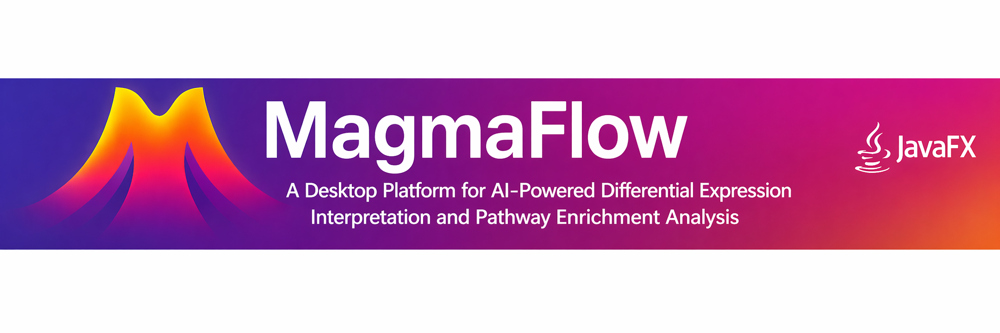
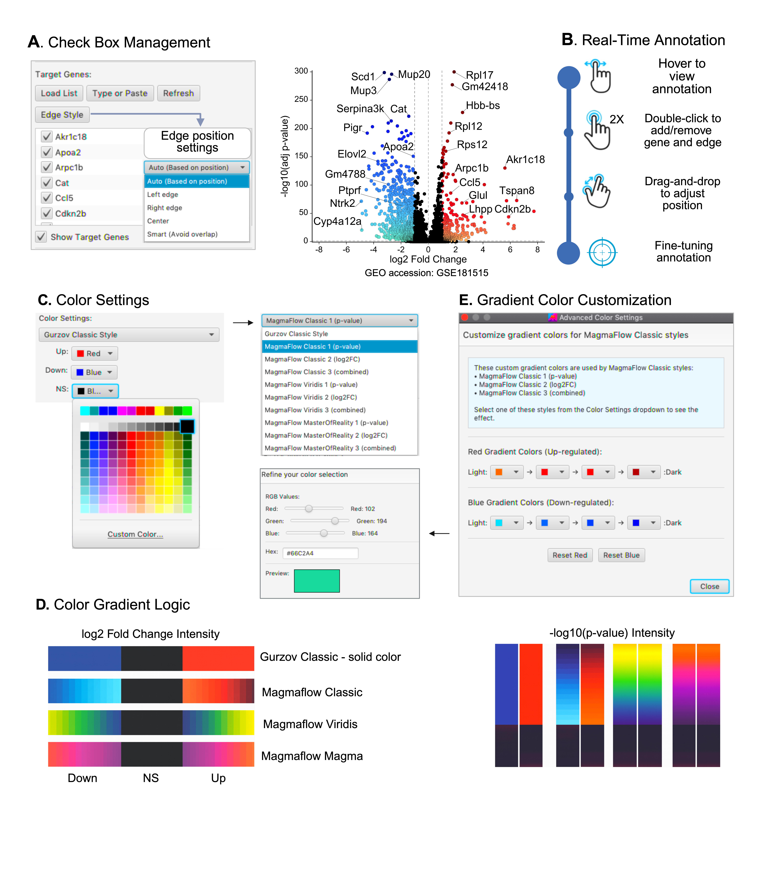

  

<h1 align="center">MagmaFlow</h1>

<h3 align="center"><i>An Integrated Desktop Platform for Differential Expression Interpretation Through AI-Powered Literature Annotation and Pathway Network Analysis</i></h3>

  
  
  
  

---

## Overview

**MagmaFlow** is a cross-platform desktop application combining interactive volcano plot visualization with automated annotation, integrated literature mining, and pathway-level contextual analysis. The platform retrieves relevant PubMed references, pathway memberships, and disease associations directly within an interactive visualization environment, enabling efficient, reproducible, and publication-ready analysis of transcriptomic datasets.

MagmaFlow transforms volcano plot analysis from static display into dynamic biological interpretation, representing the first tool integrating AI-powered literature contextualization with enrichment analysis to convert differential expression data into actionable insights.

**Figure 1. MagmaFlow Software Architecture and Workflow.** The platform integrates data processing, visualization, and AI-assisted annotation through a modular architecture. (A) Data import pathway for CSV files derived from standard differential expression analysis tools. (B) Direct integration via the MagmaFlowR plugin. (C) Project state management via JSON files. (D) High-resolution export options. (E) The MagmAI module serves as an integrated research assistant. (F) Gene scoring system utilizing PubTator3 API. (G) Enrichment analysis using EnrichR API. (H) Comprehensive labels derived from PubMed scoring. (I) Interactive Pathway Analysis with Circular Network visualizations.

---

## Key Features

### Interactive Visualization

| Feature | Description |
|:--------|:------------|
| **Double-Click Gene Selection** | Instantly add/remove target genes by double-clicking data points |
| **Drag & Drop Labels** | Reposition gene annotations with collision avoidance for publication-ready figures |
| **Smart Edge Connections** | Five layout modes (Auto, Left, Right, Center, Smart) to reduce overlap |
| **Advanced Zoom & Pan** | SHIFT+drag panning, mouse wheel zooming, one-click fit-to-viewport |
| **Real-time Hover Tooltips** | Live gene details displaying name, log₂FC, p-value, and adjusted p-value |

---

### Target Gene Management

| Feature | Description |
|:--------|:------------|
| **Checkbox Control** | Synchronized checkboxes for real-time activation/deactivation of annotations |
| **File Import** | Load target gene lists from text files |
| **Manual Entry** | Type or paste gene names with smart parsing |
| **Smart Positioning** | Auto-prevent label overlaps with intelligent spacing |

---

### Color Systems

| Style | Description |
|:------|:------------|
| **Gurzov Classic** | Traditional blue/red coloring for down/up-regulated genes |
| **MagmaFlow Classic 1** | P-value based gradients |
| **MagmaFlow Classic 2** | Log₂ fold change based gradients |
| **MagmaFlow Classic 3** | Combined p-value and fold change gradients |
| **Viridis & Magma** | Perceptually uniform, color-blind-friendly scientific palettes |
| **Custom Color Pickers** | Direct RGB/Hex color refinement with adjustable outlines and transparency |

---

### Precision Customization

| Feature | Description |
|:--------|:------------|
| **Independent Font Controls** | Separate sizes for title, axes, ticks, and annotations |
| **Dynamic Thresholds** | Real-time p-value and log₂FC cutoff adjustment |
| **Smart Tick Spacing** | Auto or manual axis intervals for perfect scaling |
| **Advanced Dot Styling** | Opacity, outlines, sizes with live preview |
| **Publication Export** | High-resolution PNG (72–1200 DPI) with scalable off-screen rendering |

---

### Project Workflow

| Feature | Description |
|:--------|:------------|
| **Smart CSV Import** | Automatic detection of standard columns via regular expressions; manual mapping dialog for non-standard headers |
| **Complete Project Files** | JSON format preserving gene data, thresholds, annotations, label positions, and display preferences |
| **Auto-save Tracking** | Visual indicators for unsaved changes to prevent data loss |
| **Session Persistence** | Remember your work across application restarts |

---

### R Integration

| Feature | Description |
|:--------|:------------|
| **MagmaFlowR Package** | Companion R package for integration with DESeq2, edgeR, limma, and Seurat pipelines |
| **mag_landragem()** | Launch MagmaFlow GUI and preload expression data directly from R environment |
| **Repository** | [github.com/carlosbuss1/magmaflowR](https://github.com/carlosbuss1/magmaflowR) |

**Figure 2. Interactive annotation, label management, and color customization.** (A) Target gene labels managed through synchronized checkboxes. (B) Interactive exploration with hover tooltips and double-click selection. (C) Customizable Gurzov-style solid palette. (D) Gradient modes: Classic, Viridis, and Magma palettes. (E) Fine-tuning of gradient color customization.

---

## Literature Mining Module

| Feature | Description |
|:--------|:------------|
| **PubTator3 Integration** | AI-powered named entity recognition across 36 million PubMed abstracts and 6 million PMC full-text articles |
| **Dynamic Context Definition** | Autocomplete for Disease/Condition (required) and Treatment/Chemical (optional) with validated MeSH identifiers |
| **Relation Types Configuration** | Positive/negative correlation, stimulation, inhibition, or general association to match expression patterns |
| **Dual-API Strategy** | PubTator3 Relations API for Total and Context papers; NCBI E-utilities for Recent papers (default: 2020 onwards, customizable) and PMIDs |
| **Disease Synonym Expansion** | Automatic inclusion of abbreviations and related terms for disease-specific searches |
| **Log-Scaled Scoring** | Composite score (2×log(1+Total) + 8×log(1+Context) + 5×log(1+Recent) + StatsBonus) preventing highly-studied genes from dominating |
| **Clickable PMID Links** | Direct access to publications sorted by date (newest first) |

**Figure 3. Literature Mining module integrating PubTator3 with NCBI E-utilities.** (A) Context Definition through PubTator3 dynamic autocomplete with Disease/Condition and Treatment/Chemical selection. (B) Literature Mining with dual-API strategy retrieving Total Papers, Context-Relevant Papers, and Recent Papers. (C) Literature-Centric Scoring with log-scaled composite score and disease synonym expansion. (D) Curated Cross-Referenced Gene Annotation with ranked genes, evidence summaries, and clickable PMID links.

---

## Pathway Enrichment and Circle Plot Visualization

| Feature | Description |
|:--------|:------------|
| **Enrichr API Integration** | Over-Representation Analysis across seven pathway databases |
| **Supported Databases** | Gene Ontology 2023 (BP, MF, CC), KEGG 2026, Reactome 2024, WikiPathways 2024, MSigDB Hallmark 2025 |
| **Species Support** | Human, Mouse, and Cow (*Bos taurus*, GO only) |
| **Analysis Modes** | All significant genes combined, or separate up/down-regulated analyses |
| **Circle Plot Visualization** | Multi-layer circular diagrams with pathway enrichment, gene expression, and database annotations. A dedicated customization console allows full configuration of plot dimensions, node sizes, label font sizes, label orientation, edge weights, and color schemes |
| **Cross-Pathway Detection** | Curved lines connecting genes appearing in multiple pathways reveal functional relationships |
| **Bidirectional Workflow** | Pathway discovery informs gene prioritization; volcano visualization contextualizes shared pathway genes |

**Figure 4. Integrated pathway enrichment analysis with interactive visualization.** (A) EnrichR API Integration querying multiple pathway databases. (B) Volcano Plot Pathway Annotation with automatic gene highlighting. (C) Pathway Network Circle Plot displaying pathway enrichment significance, gene expression levels, and database source annotations.

---

## Download

### Ready-to-Use Applications

  
  &nbsp;&nbsp;&nbsp;&nbsp;
  
  &nbsp;&nbsp;&nbsp;&nbsp;
  

### All Releases

Visit our [Zenodo repository](https://zenodo.org/records/19736190) for all versions and additional files.

> **Note:** MagmaFlow is distributed as a pre-built application only. Source code is not publicly available. The software is maintained under the stewardship of the Knowledge and Technology Transfer Office (KTO) of the Université libre de Bruxelles (ULB).

---

## System Requirements

### macOS — Apple Silicon (arm64)

| Specification | Requirement |
|:--------------|:------------|
| **Chip** | Apple M1, M2, M3, or M4 (Mac purchased 2020 or later) |
| **macOS** | macOS 11 Big Sur or later (macOS 13 Ventura or later recommended) |
| **RAM** | 4 GB minimum — 8 GB recommended for datasets >30,000 genes |
| **Display** | 1280 × 720 minimum — Full HD (1920 × 1080) recommended |

### macOS — Intel (x86_64 legacy build, all Intel Macs)

| Specification | Requirement |
|:--------------|:------------|
| **Chip** | Intel Core i5, i7, or i9 (64-bit) — any Intel Mac |
| **macOS** | macOS 10.12 Sierra or later |
| **RAM** | 4 GB minimum — 8 GB recommended for datasets >30,000 genes |
| **Display** | 1280 × 720 minimum — Full HD (1920 × 1080) recommended |

### Windows

| Specification | Requirement |
|:--------------|:------------|
| **OS** | Windows 10 (64-bit) or later — Windows 11 recommended |
| **RAM** | 4 GB minimum — 8 GB recommended for datasets >30,000 genes |
| **Display** | 1280 × 720 minimum — Full HD (1920 × 1080) recommended |

---

## Installation

### macOS — Apple Silicon

| Step | Action |
|:----:|:-------|
| 1 | Confirm your Mac has an Apple M1/M2/M3/M4 chip: Apple menu → About This Mac → Chip |
| 2 | Download `MagmaFlow-MacOs_arm64-10.0.5.dmg` |
| 3 | Open the DMG and drag MagmaFlow to your Applications folder |
| 4 | Launch MagmaFlow from the Applications folder |

> **macOS Security (Apple Silicon):** MagmaFlow is code-signed and notarized through the Apple Developer Program (Team ID: 2SYQA7494X). No Gatekeeper warnings will appear.

### macOS — Intel (all versions)

| Step | Action |
|:----:|:-------|
| 1 | Confirm your Mac has an Intel processor: Apple menu → About This Mac → Processor |
| 2 | Download `MagmaFlow-x86_64_10.0.5.dmg` |
| 3 | Right-click the DMG and select **Open** |
| 4 | Click **Open** in the security dialog |
| 5 | Drag MagmaFlow to your Applications folder and launch normally |

> **macOS Security (Intel):** The Intel build is distributed without Apple notarization due to a known incompatibility between Apple's hardened runtime requirement and the JVM memory model on older macOS versions. The right-click open step is a standard one-time Gatekeeper override for trusted software and is fully documented in Apple's official guidance.

### Windows

| Step | Action |
|:----:|:-------|
| 1 | Download the EXE installer from the link above |
| 2 | Run the installer and follow the setup wizard |
| 3 | Launch MagmaFlow from Start Menu or desktop shortcut |

---

## Technical Implementation

| Component | Technology |
|:----------|:-----------|
| **Framework** | JavaFX 17.0.2 |
| **Compiler** | JDK 17 (LTS) |
| **Architecture** | Model-View-Controller (MVC) |
| **Rendering** | JavaFX Canvas API with GPU-accelerated GraphicsContext |
| **Precision** | Double-precision floating-point arithmetic |

---

## External API Integration

| API | Purpose | Endpoint |
|:----|:--------|:---------|
| **PubTator3** | AI-powered named entity recognition | `https://www.ncbi.nlm.nih.gov/research/pubtator3-api` |
| **NCBI E-utilities** | Date-filtered publication queries (default: 2020 onwards, customizable) | `https://eutils.ncbi.nlm.nih.gov/entrez/eutils/` |
| **Enrichr** | Over-Representation Analysis | `https://maayanlab.cloud/Enrichr/` |

---

## License

### MagmaFlow Academic Binary – End-User License Agreement (EULA)

**Version Jan-2026**

By downloading, installing, or using the MagmaFlow executable (the "Software") you ("Licensee") agree to the terms of this EULA with the **Université libre de Bruxelles**, Avenue F. Roosevelt 50, B-1050 Brussels, Belgium ("ULB"), which owns all intellectual-property rights in the Software.

#### Definitions

| Term | Definition |
|:-----|:-----------|
| **Executable / Software** | The compiled distribution of MagmaFlow (DMG, MSI, JAR or similar) provided by ULB |
| **Academic Use** | Use by accredited higher-education or publicly funded research bodies, for teaching, research, or other not-for-profit scholarly purposes |
| **Non-Commercial** | Any activity not primarily intended for commercial gain and not carried out for the benefit of a for-profit entity |

#### License Grant

Subject to this EULA, ULB grants Licensee a **non-exclusive, non-transferable, royalty-free licence** to download, install, and run the Software solely for Academic and Non-Commercial purposes. No right to sublicense is granted.

#### Restrictions

Licensee shall not:
- Use the Software for any Commercial purpose without prior written consent from ULB
- Modify, adapt, translate, or create derivative works of the Software
- Reverse-engineer, decompile, or disassemble the Software except as permitted by applicable law
- Offer the Software to third parties as a hosted or cloud service (SaaS) or otherwise provide remote access
- Publish the Software or this EULA on public repositories, websites, or mirrors

#### Warranty Disclaimer

ULB provides the Software **"as is"** and disclaims all warranties, express or implied, including the warranties of merchantability, fitness for a particular purpose, and non-infringement.

#### Governing Law

This EULA is governed by Belgian law. Any dispute arising under it shall be submitted to the exclusive jurisdiction of the courts of Brussels.

---

**For Commercial licensing inquiries:** carlos.eduardo.buss@ulb.be

---

## Citation

If you use MagmaFlow in your research, please cite:

> Buss, C. E. (2026). MagmaFlow_v10.0.5: MagmaFlow An Integrated Desktop Platform for Differential Expression Interpretation Through AI-Powered Literature Annotation and Enrichment Analysis (v10.0.5). Zenodo. https://doi.org/10.5281/zenodo.19736190

---

## Contact

| Purpose | Contact |
|:--------|:--------|
| **Questions & Bug Reports** | Open an issue on [GitHub](https://github.com/carlosbuss1/MagmaFlow/issues) |
| **Commercial Licensing** | carlos.eduardo.buss@ulb.be |
