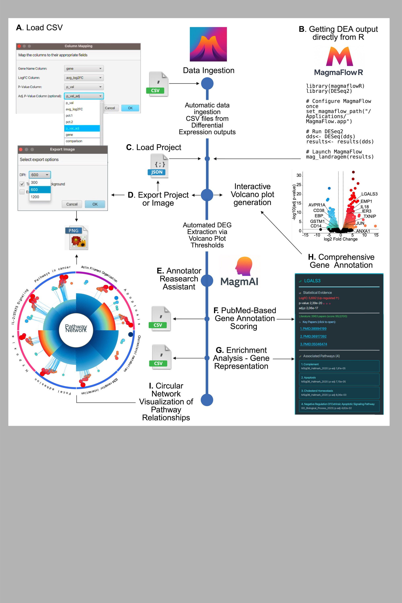

<p align="center">
  
</p>

<h1 align="center">MagmaFlow</h1>

<h3 align="center"><i>An Integrated Desktop Platform for Differential Expression Interpretation Through<br/>AI-Powered Literature Annotation and Pathway Network Analysis</i></h3>

<p align="center">
  <a href="https://www.oracle.com/java/"></a>
  <a href="https://openjfx.io/"></a>
  <a href="#license"></a>
  <a href="https://zenodo.org/records/18380556"></a>
</p>

---

## Overview

**MagmaFlow** is a cross-platform desktop application combining interactive volcano plot visualization with automated annotation, integrated literature mining, and pathway-level contextual analysis. The platform retrieves relevant PubMed references, pathway memberships, and disease associations directly within an interactive visualization environment, enabling efficient, reproducible, and publication-ready analysis of transcriptomic datasets.

MagmaFlow transforms volcano plot analysis from static display into dynamic biological interpretation, representing the first tool integrating AI-powered literature contextualization with enrichment analysis to convert differential expression data into actionable insights.

<p align="center">
  
</p>

**Figure 1. MagmaFlow Software Architecture and Workflow.** The platform integrates data processing, visualization, and AI-assisted annotation through a modular architecture. (A) Data import pathway for CSV files derived from standard differential expression analysis tools. (B) Direct integration via the MagmaFlowR plugin. (C) Project state management via JSON files. (D) High-resolution export options. (E) The MagmAI module serves as an integrated research assistant. (F) Gene scoring system utilizing PubTator3 API. (G) Enrichment analysis using EnrichR API. (H) Comprehensive labels derived from PubMed scoring. (I) Interactive Pathway Analysis with Circular Network visualizations.

---

## Key Features

### Interactive Visualization

| Feature | Description |
|:--------|:------------|
| **Double-Click Gene Selection** | Instantly add/remove target genes by double-clicking data points |
| **Drag & Drop Labels** | Reposition gene annotations with collision avoidance for publication-ready figures |
| **Real-time Filtering** | Adjust p-value and log2 fold-change thresholds dynamically |
| **High-resolution Export** | Export figures as PNG, JPEG, or SVG for publications |

### AI-Powered Annotation

| Feature | Description |
|:--------|:------------|
| **MagmAI Assistant** | Integrated research assistant for gene function interpretation |
| **PubMed Mining** | Automatic retrieval of relevant literature via PubTator3 API |
| **Gene Scoring** | Context-aware relevance scoring based on publication frequency |
| **Disease Associations** | Automatic mapping to known disease-gene relationships |

### Pathway Analysis

| Feature | Description |
|:--------|:------------|
| **Enrichment Analysis** | Integration with EnrichR API for pathway overrepresentation |
| **Circular Network Visualization** | Interactive pathway relationship networks |
| **Multi-database Support** | KEGG, GO, Reactome, and custom gene sets |
| **Exportable Results** | Tables and networks ready for publication |

---

## Installation

### Prerequisites

- **Java 17** or higher ([Download](https://www.oracle.com/java/technologies/downloads/))
- **Internet connection** for API-based features (PubMed, EnrichR)

### Download

Download the latest release from the [Releases page](https://github.com/carlosbuss1/MagmaFlow/releases)

### Platform-specific Instructions

#### Windows
1. Double-click `MagmaFlow-*.exe`
2. Follow installation wizard
3. Launch from Start Menu

#### macOS
```bash
# Download the .dmg file
# Open and drag MagmaFlow to Applications folder
# Launch from Applications
